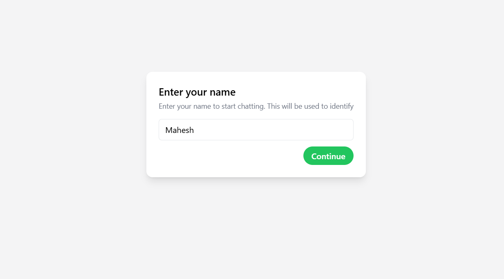
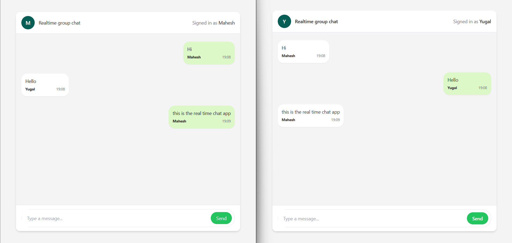

# 🔌 Socket Chat App

A simple real-time chat application built with **Node.js**, **Express**, **Socket.IO**, and a **React frontend**.  
This project demonstrates the basics of WebSocket communication for real-time messaging — similar to WhatsApp (basic version).

---

## Visit the Website

## [Realtime Chat App](https://socket-realtime-chat.vercel.app)

## 🚀 Tech Stack

**Frontend**

- React (Vite)
- TailwindCSS
- Socket.IO Client

**Backend**

- Node.js
- Express.js
- Socket.IO

---

## ✨ Features

- 🔄 Real-time messaging between users
- 🌐 WebSocket connection using Socket.IO
- 🖥️ Simple frontend + backend integration
- 🎯 CORS restricted to your frontend only

---

## ⚙️ Setup Guide

### 📂 Clone the Repository

```bash
git clone https://github.com/maheshhattimare/socket-chat-app.git
cd socket-chat-app
```

---

### ▶️ Backend Setup

```bash
cd backend
npm install
npm run dev
```

Backend will run by default on **http://localhost:3000**

---

### 💻 Frontend Setup

```bash
cd frontend
npm install
npm run dev
```

Frontend will run by default on **http://localhost:5173**

---

## 📸 Screenshots

### Add Name


_Enter your name here_

### Chat


_Live chat_

---

## 📝 Notes

- Update the **CORS origin** in `backend/server.js` with your frontend URL.
- Make sure both backend and frontend are running simultaneously for full functionality.

---

## 🤝 Contributing

Pull requests are welcome! Feel free to fork the repo and submit improvements.

---

## 📜 License

This project is for learning purposes.
